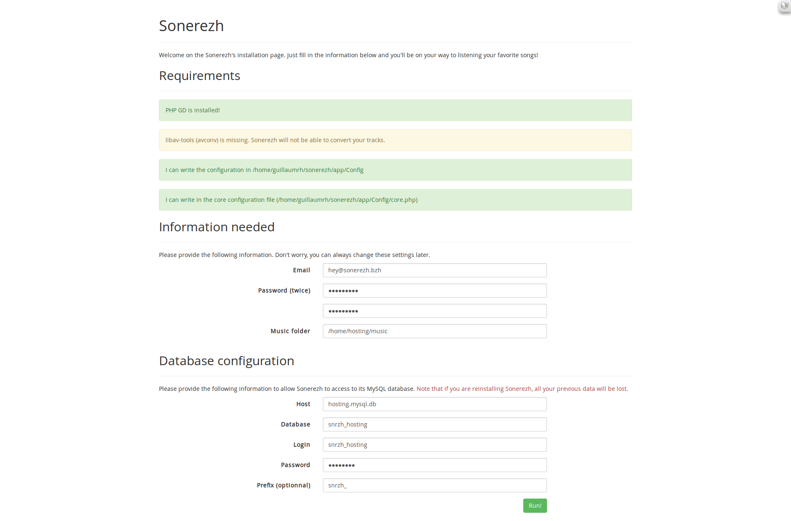

Installation
============

Sonerezh ne requiert pas de manipulations particulières et s'installe comme toute application PHP classique.

Installation sur un hébergement dédié
-------------------------------------

Nous vous recommandons d'utiliser ``git`` pour récupérer les sources du projet, cela facilitera le processus de mise à jour.

.. note:: Nous allons installer sonerezh dans ``/var/www/sonerezh``, pour pouvoir y accéder à l'adresse http://demo.sonerezh.bzh.

.. code-block:: sh

    cd /var/www
    sudo git pull https://github.com/Sonerezh/sonerezh.git
    sudo chown -R wwww-data: sonerezh/ && sudo chmod -R 775 sonerezh/

C'est prêt ! Vous n'avez plus qu'à vous rendre sur http://demo.sonerezh.bzh/install et à remplir les informations demandées (à adapter à votre configuration).

Validez, et c'est bon ! :)

Installation sur un hébergement mutualisé
-----------------------------------------

Les hébergements de type mutualisés ne vous permettent pas un accès complet. La configuration du nom de domaine ou de votre espace dépendant de votre hébergeur, nous ne détaillerons pas ces étapes.

.. note:: Nous allons déployer les sources dans ``sonerezh/``, à l'adresse http://demo.sonerezh.bzh.

1) Récupérez votre copie de sonerezh `sur notre dépôt GitHub`_
2) Déposez cette archive sur votre hébergement et décompressez-la dans ``sonerezh/``
3) Rendez-vous sur http://demo.sonerezh.bzh/install
4) Remplissez les champs 

5) Validez. C'est bon ! :)

.. _sur notre dépôt GitHub: https://github.com/Sonerezh/sonerezh/archive/master.zip
